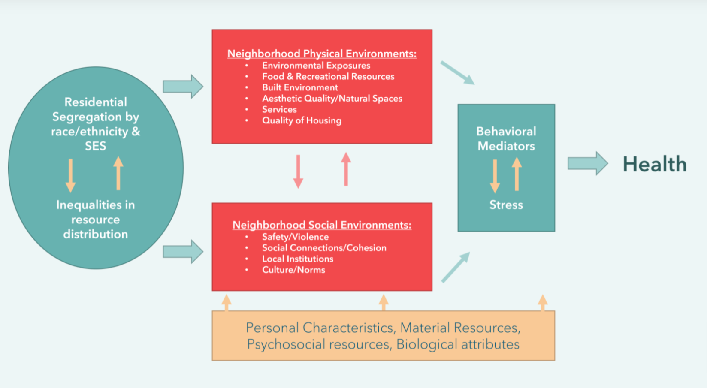
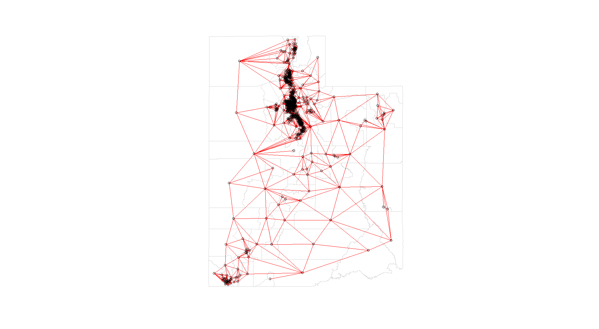
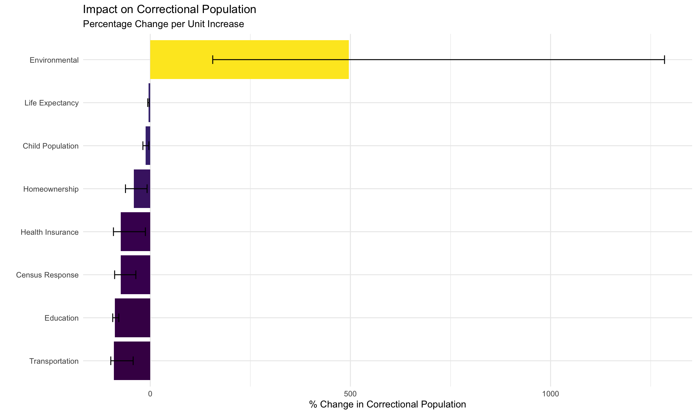

```{r setup, include=FALSE}
options(htmltools.dir.version = FALSE)

knitr::opts_chunk$set(
  fig.width = 10, fig.height = 6, fig.retina = 3,
  out.width = "100%", cache = FALSE,
  echo = FALSE, message = FALSE, warning = FALSE,
  hiline = TRUE
)

library(xaringan)
library(xaringanExtra)
library(ggplot2)
library(dplyr)
library(plotly)
library(viridis)
library(kableExtra)
library(tidyr)
library(scales)
library(patchwork)
library(DT)
library(emoji)
library(ggplot2)
library(ggtext)
library(gridExtra)
library(grid)
library(leaflet)
library(tidyverse)

# Use xaringanExtra features
xaringanExtra::use_tile_view()
xaringanExtra::use_animate_all("slide_left")
xaringanExtra::use_panelset()
xaringanExtra::use_clipboard()
xaringanExtra::use_search()
xaringanExtra::use_progress_bar()
xaringanExtra::use_scribble()
xaringanExtra::use_fit_screen()
xaringanExtra::use_extra_styles(
  hover_code_line = TRUE,
  mute_unhighlighted_code = TRUE
)
xaringanExtra::style_panelset_tabs(
  active_foreground = "#0051BA",
  hover_foreground = "#0051BA"
)

# Correct way to style with xaringanthemer
library(xaringanthemer)
style_mono_dark(
  base_color = "#FF8C00",
  header_font_google = google_font("Yanone Kaffeesatz"),
  text_font_google = google_font("Montserrat"),
  code_font_google = google_font("Fira Mono")
)

# Add custom CSS to modify specific elements
extra_css <- list(
  ".title-slide h1" = list(
    "color" = "#00BFFF"
  ),
  ".title-slide h2" = list(
    "color" = "#00BFFF"
  ),
  ".title-slide h3" = list(
    "color" = "#FF8C00"
  ),
  "h1, h2, h3" = list(
    "color" = "#00BFFF"
  ),
  ".remark-slide-content" = list(
    "background-color" = "#333333",
    "color" = "#FF8C00"
  ),
  "a" = list(
    "color" = "#FF8C00"
  )
)

# Apply the extra CSS
style_extra_css(extra_css)

# Import spatial data
library(sf)
model_data_hpi <- st_read("model_data_hpi.shp")

```

```{r data-import, include=FALSE}
# Import spatial data
library(sf)
model_data_hpi <- st_read("model_data_hpi.shp")
```

class: left, middle, inverse
---
# Research Question
.large[
### 1. How is the correctional population spatially distributed across neighborhoods in Utah?

### 2. What are the neighborhood risks associated with the correctional population?
]

???
Presenter notes:
- Emphasize spatial variation
- Focus on risk factors
- Consider policy implications


class: left, center
---
# Why does this matter for policy research? 

#### Parole population in UT (and nationwide) has been facing a particular large increase due to technical violations and increases in new crimes for non-violent/drug possession related crimes. Since 2012, the probation population increased by 17.8 percent and 47.1 percent for the parole population due to a significant increase in admissions. Moreover, probation revocations grew by 42 percent and parolee revocations grew by 42 percent between 2015 and 2018. 

### More effective resource allocation decisions with scarce budgets! 


---
# Neighborhood Effects: Data Support
```{r, echo=FALSE, fig.align = 'center', out.width="90%"}

```


---

# Literature Review

.large[
1. Simes (2021) - [Punishing Places](https://www.ucpress.edu/books/punishing-places/paper)
   * Extensive study examining neighborhood effects on incarcerated individuals. First to conceptualize "punishment vulnerability" embedded in place. 
   
2. Sampson, R. J. (2012) - [Great American City: Chicago and the Enduring Neighborhood Effect.](https://press.uchicago.edu/ucp/books/book/chicago/G/bo220538022.html)
   * Neighborhoods social cohesion shape long term outcomes and spatial inequality. Links neighborhood effects to mass incarceration.

3. Chetty et al. (2018) - [The Opportunity Atlas: Mapping the Childhood Roots of Social Mobility](https://ideas.repec.org/p/nbr/nberwo/25147.html#refs)
    * Places  with high rates of poverty, single-parent households, and lack of exposure to adults who are college-educated causally impact income, health, incarceration, and college attendance outcomes. 
    
]

---

# Literature Review 2

.large[
4. Simes & Jahn (2022) - [The consequences of Medicaid expansion under the Affordable Care Act for police arrests](https://pubmed.ncbi.nlm.nih.gov/35020737/)
   * Arrests decreased with Medicaid expansion, 25-41% negative difference in drug arrests in first 3 years.

5. Sharkey et al. (2017) - [Community and the Crime Decline: The Causal Effect of Local Nonprofits on Violent Crime](https://journals.sagepub.com/doi/abs/10.1177/0003122417736289)
   * Every 10 additional organizations focusing on crime and community life in a city leads to a 9 percent reduction in the murder rate, a 6 percent reduction in the violent crime rate, and a 4 percent reduction in the property crime rate.
]

---

# Data Sources

.panelset[
.panel[.panel-name[Corrections Data]
**Utah Department of Corrections** 
* Correctional address data (2016-2023)
  * Geocoded to census tracts, only residential addresses extracted
  * 86,734 original observations --> **47,529 final observations** 
  * 35, 052 unique IDs (many repeated addresses at different episodes)
* Supervision type categories: Parole or Probation
* Risk assessment scores
* Violation reports
* Demographic
]

.panel[.panel-name[Census Variables]
**ACS Census Data 5-year estimates (2017-2022)**
* Population demographics
  * children
  * median age
* Socioeconomic indicators
  * unemployment
  * public assistance
  * female headed households
]

.panel[.panel-name[Healthy Places Index]
**Utah Healthy Places Index Variables**
* Air quality measures
  * diesel particulate matter
* Health
  * insurance enrollment, life expectancy
* Transportation access
  * automobile access, bike lane access, traffic
* Community cohesion/collective efficacy
  * census response
* Housing characteristics
  * overcrowded, housing repair, home ownership, rent severe
* Employment statistics: unemployment
* Economic: per capita income
* Education levels: bachelor's degree
]
]


---

# Spatial Distribution of Correctional Population

```{r spatial, echo=FALSE}
# Assuming model_data_hpi is your dataset
leaflet(model_data_hpi) %>%
  addTiles() %>%
  addPolygons(
    fillColor = ~colorQuantile("YlOrRd", corr_rt)(corr_rt),
    fillOpacity = 0.7,
    weight = 1,
    color = "#FFFFFF",
    popup = ~paste(
      "<strong>Tract:</strong>", NAM, "<br>",
      "<strong>Rate:</strong>", round(corr_rt, 2), "<br>",
      "<strong>Hispanic:</strong>", round(phisp, 2), "<br>",
      "<strong>Unemployment:</strong>", round(punemp, 2)
    )
  ) %>%
  addLegend(
    position = "bottomright",
    pal = colorQuantile("YlOrRd", model_data_hpi$corr_rt),
    values = model_data_hpi$corr_rt,
    title = "Correctional Population Rate per 1000"
  )
```


---

# Model Specification


### INLA-BYM2 Specification
$$
\begin{aligned}
y_i &\sim \text{Poisson}(\mu_i) \\
\log(\mu_i) &= \log(E_i) + \alpha + \sum_{j=1}^p \beta_j x_{ij} + u_i + v_i \\
\text{where:} & \\
u_i &\sim \text{ICAR}(\tau_u, \phi) \\
v_i &\sim \mathcal{N}(0, \tau_v^{-1})
\end{aligned}
$$


.pull-left[
### Parameters
- $y_i$: Observed count in area i
- $E_i$: Expected count
- $\alpha$: Intercept
- $\beta_j$: Fixed effects / neighborhood covariates 
]

.pull-right[
### Random Effects
- $u_i$: Spatial structure
- $v_i$: Unstructured
- $\phi$: Mixing parameter
]

---

# Benefits of INLA Methods

**Traditional econometric methods (OLS/Maximum Likelihood) give you single "best" estimates. INLA instead tells you about all possible values your parameters could take, with their probabilities. This is particularly useful for policy translation.**

.pull-left[
### INLA BYM2
* Full posterior distributions
  * Estimates actual risk levels for each area while accounting for neighboring areas
* Efficient computation O(n^(3/2))
  * Complex spatial dependencies
* Interpretable spatial parameters
* Direct uncertainty quantification
* Better policy targeting, accurate risk assessment
]

.pull-right[
### Spatial Poisson
* Point estimates only
* Slower computation O(n³)
* Complex parameter interpretation
* Bootstrap required for uncertainty
]

---
# Who is your neighbor? 
**Tobler’s First Law of Geography states that: Everything is related to everything else, but near things are more related than distant things.**
* We need to establish how neighborhoods in SLCO are spatially connected to one another: Neighborhood Weight Matrix (queen contiguity)

```{r, echo=FALSE, fig.align = 'center', out.width="70%"}

```


---
# Results

.panel[.panel-name[Statistical Results]
```{r results-table, echo=FALSE}
results_df <-read.csv("results_df.csv")

DT::datatable(results_df,
              options = list(
  columnDefs = list(list(className = 'dt-center', targets = 5)),
  pageLength = 5,
  order=list(list(10,'desc')),
  lengthMenu = c(5, 10, 15, 20)))
              
```
]


---
# Significant Results
```{r, echo=FALSE, fig.align = 'center', out.width="85%"}

```

???
Key Findings
* Strongest predictor
* Non-linear relationship
* Environmental justice implications
* Need for targeted intervention


---
#Policy Priority Matrix

.panelset[
.panel[.panel-name[Policy Priority]
```{r priority-matrix, echo=FALSE}
library(kableExtra)

policy_matrix <- data.frame(
  Rank = 1:8,
  `Policy Area` = c("Environmental Justice", 
                    "Automobile Access", 
                    "Education",
                    "Census Response", 
                    "Health Insurance", 
                    "Homeownership",
                    "Child Population", 
                    "Life Expectancy"),
  `Effect Size` = c("+494.7%", 
                    "-91.0%", 
                    "-88.4%", 
                    "-73.6%", 
                    "-73.3%", 
                    "-40.8%", 
                    "-11.1%", 
                    "-4.6%"),
  `Evidence Base` = c("Strong", 
                      "Strong", 
                      "Strong", 
                      "Strong", 
                      "Strong",
                      "Moderate", 
                      "Moderate", 
                      "Strong")
)

kable(policy_matrix) %>%
  kable_styling(bootstrap_options = c("striped", "hover"),
                full_width = FALSE) %>%
  row_spec(0, bold = TRUE, background = "gray95")


```
]

.panel[.panel-name[Policy Translation]
* Air pollution <=> Disproportionately affects low-income communities and communities of color
* Improve Transportation Access, work with correctional officers to reduce technical violation terms related to transportation barriers
* Target education access in high risk communities
* Enhance collective efficacy through targeted community engagement across stakeholders
* Improve access to insurance enrollment => Mobile Medical Clinics, health system literacy  
* Support housing stability 
* Improve health outcomes
* **Target high-risk communities with policy interventions and working with local stakeholders**
* **Prioritize grant funding for these high-risk communities**
]
]


---
# Relative Risk: Air Pollution
*** Relative Risk values > 1, this means there is higher risk than expected. Areas with higher RR values likely have more Diesel Particulate Matter than expected. 
*** 2.42 in Carbon County, then there is 142% more correctional population than expected. Or a place like Morgan county is 0.21 RR has 79% lower correctional population than expected which likely represents an area with better air quality.

```{r LEAFLET, echo=FALSE}

pal <- colorQuantile(palette = "YlOrRd", domain = model_data_hpi$RR, n= 7)


labels <- sprintf("<strong> %s </strong> <br/>
  Observed: %s <br/> Expected: %s <br/>
  Air Pollution: %s <br/> SIR: %s <br/> RR: %s (%s, %s)",
                  model_data_hpi$NAM, model_data_hpi$corr_pp, round(model_data_hpi$expectd, 2),
                  model_data_hpi$dieslpm, round(model_data_hpi$SIR, 2), round(model_data_hpi$RR, 2),
                  round(model_data_hpi$LL, 2), round(model_data_hpi$UL, 2)
) %>% lapply(htmltools::HTML)

#LEAFLET MAPPING!
lRR <- leaflet(model_data_hpi) %>%
  addTiles() %>%
  addPolygons(
    color = "grey", weight = 1, fillColor = ~ pal(RR),
    fillOpacity = 0.5,
    highlightOptions = highlightOptions(weight = 4),
    label = labels,
    labelOptions = labelOptions(
      style =
        list(
          "font-weight" = "normal",
          padding = "3px 8px"
        ),
      textsize = "15px", direction = "auto"
    )
  ) %>%
  addLegend(
    pal = pal, values = ~RR, opacity = 0.5, title = "RR",
    position = "bottomright",
    labelFormat(transform = function(RR) sort(RR, increasing = TRUE))
  )
lRR
```


---
class: left

# Spatial Components

.panelset[
.panel[.panel-name[Statistics]
```{r spatial-stats}
spatial_components <- data.frame(
  Component = c("Structured (Phi)", "Precision (re_u)", "Precision (re_v)"),
  Value = c(0.594, 2.79, 21100),
  Interpretation = c("59.4% spatial structure",
                    "Strong spatial dependence",
                    "Low unstructured variation")
)

DT::datatable(spatial_components,
              options = list(pageLength = 5),
              rownames = FALSE)
```
]

.panel[.panel-name[Model Fit]
```{r model-fit}
fit_stats <- data.frame(
  Metric = c("DIC", "WAIC", "Effective Parameters"),
  Value = c(5199.78, 5073.35, "355.10-622.11")
)

DT::datatable(fit_stats,
              options = list(pageLength = 5),
              rownames = FALSE)
```
]
]


---
class: inverse, center, middle

# Thank You!

**sheena.yoon@utah.edu**

[**Website**](https://www.sheenayoon.com)


